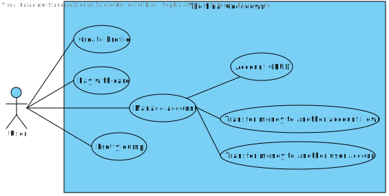
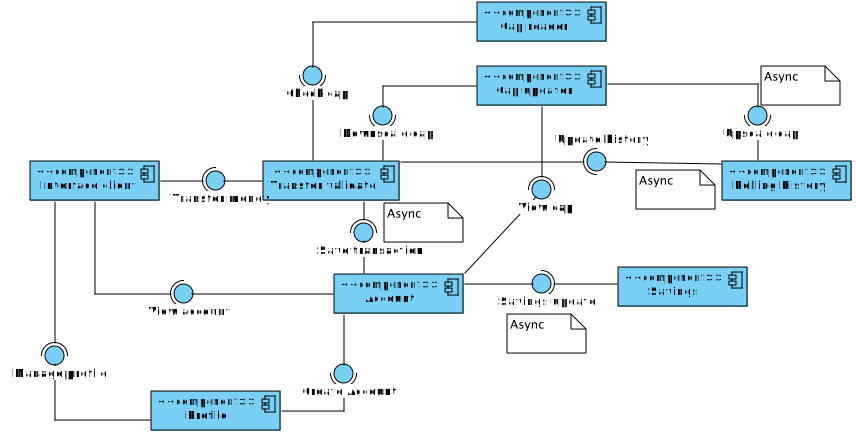
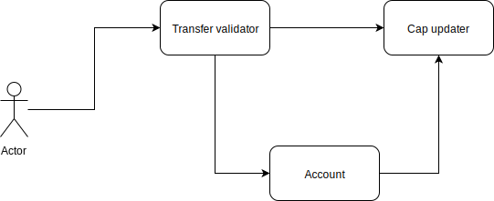
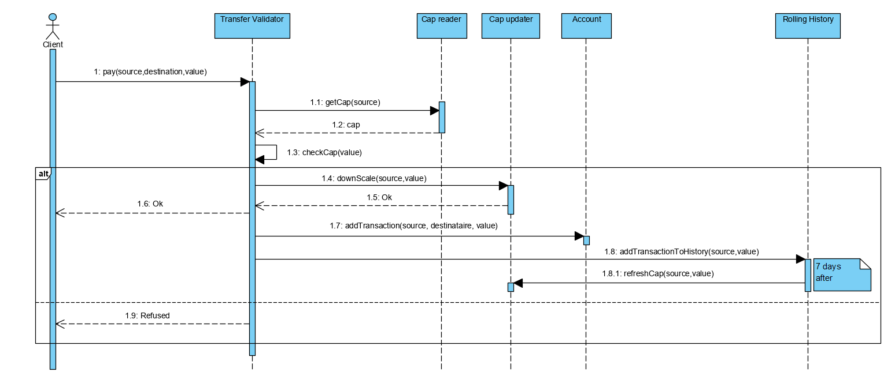
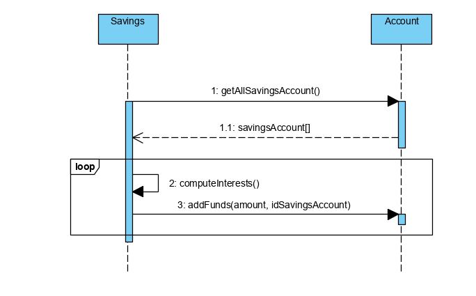
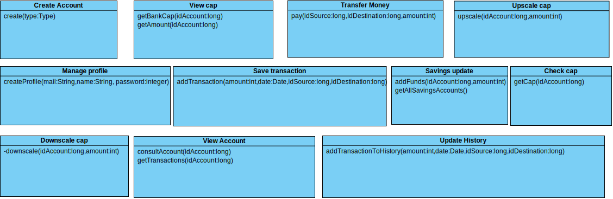

# Groupe AL-E
# V9 Scale Load generator and architecture to handle loads

## Exclusion du scope

Notre objectif est de mettre en place un service capable de passer à l'échelle face à une montée en charge. Nous n'allons pas développer d'interface graphique pour nous concentrer sur l'architecture et les capacités de montée en charge de notre back-end. C'est pour ces même raisons que nous n'allons pas mettre en place les paiements entre amis à l'aide de téléphones portables.  
L'aspect sécuritaire n'est pas notre premier objectif à l'heure actuelle non plus, malgré le fait que certaines couches de sécurité peuvent impacter les performances globales.  
Notre solution se concentrera uniquement sur la gestion de l'argent et pas sur les actions, ni sur le portfolio.

## Inclusion du scope 

- Un utilisateur possède un profil, qui est associé à un ou plusieurs comptes. Chaque compte chèque est accompagné d'une carte de débit. Il n'y a pas de carte pour un compte épargne. Les cartes de crédit ne sont pas supportées par le système.
- Gestion de plusieurs types de comptes : chèque / épargne.
- Transactions entre comptes du même profil et de profils différents autorisées.
- A la création d'un compte, l'utilisateur possédera un montant d'argent fixe.
- Les comptes épargne fonctionnent sous un régime de calculs bi-mensuels d'intérêts.
- Pretty dump afin d'agréger différentes statistiques des différents services.
- L'utilisateur peut payer avec sa carte.
- Système de plafond glissant pour les cartes.
- Pas de découvert autorisé : toute transaction passant le compte sous les 0 est refusée.

Pour notre solution nous avons prévu de développer une **CLI** minimaliste afin d'effectuer les opérations décrite ci-dessus et le Pretty Dump.  
Au niveau des calculs intéressants à surveiller nous avons le plafond glissant sur les 7 derniers jours, qui doit être vérifié à chaque transaction, ainsi que les intérêts bi-mensuels des comptes épargne. Ils permettront de prouver que notre solution est capable de tenir la montée en charge.  

Au niveau non fonctionnel, les points en gras seront ceux sur lesquels nous allons nous concentrer en premier lieu. Nous essayerons aussi de traiter les autres points en fonction de l'évolution du projet et de notre avancement.

- **Étude du système au niveau de la montée en charge, recherche de bottlenecks, de la quantité de cpu/mémoire utilisé.**
- Gestion des inconsistances des données.
- Etude du comportement si crash d'un composant.
- Comparaison de performance des différentes technologies envisagées.
- **Benchmark des différentes versions de notre solution.**
- Gestion des transactions rejetées.

## Évaluation du système

Nous avons décidé de baser notre analyse sur plusieurs points critiques marqués en gras ci-dessous : 

- **Vitesse de réponse / quantité de requêtes. (exemple : le système met deux secondes à répondre) : évaluation de la complexité empirique des opérations en fonction du nombre d'utilisateur (exemple de 100 utilisateurs à 1000 utilisateurs, temps linéaire, quadratique ou exponentiel).**
- Latence pour une opération atomique de paiement (exemple : sur les deux secondes, le système a mis 1 seconde avant de traiter la requête).
- **Vitesse de scaling horizontal (temps de démarrage d'une instance d'un service) en réponse à un pic de charge.**
- Quantité de profils supportés (temps d'accès à la base de données pour un profil par exemple).
- Gestion de la concurrence si plusieurs paiements en même temps sur le même compte avec pas assez d'argent
- **Simulation de latence réseau (localhost/ADSL/fibre/2G/3G/4G/5G)**
- Simulation de perte de paquets
- Consommation électrique : consommation des machines en fonction de la charge supportée afin d'évaluer le coût du service

## Personas

Nous avons **Roger**, qui est un utilisateur de Créditrama. Il cherche a gérer son compte sans accrocs, ou ralentissement du système qui pourrait lui faire perdre confiance en sa banque. Son objectif est de simplement pouvoir payer avec sa carte bleue 

Ensuite nous avons **Gueta**, qui profite de sa récente rentrée d'argent pour se permettre de se créer plusieurs comptes chez Créditrama. Elle a besoin de gérer plusieurs comptes, dont des comptes épargne.  

Nous avons également **Pascale**, l'administratrice du système travaillant chez Créditrama, qui a pour mission de surveiller les comptes de ses clients avec le Pretty Dump.

Enfin nous avons **Sigmund**, un des gros actionnaires de Créditrama, qui aime que le système fonctionne correctement et veut des analyses du système sous plusieurs angles afin de faire travailler les équipes de développeurs de manière efficace.

## Use case

## Diagramme de composants

## Diagramme de service

## Diagrammes de séquence

### Scénario 1 : payer

### Scénario 2 : calcul des intérêts

## Diagramme d'interfaces

# Planning

## Roadmap

### Étape 1

Produit minimum viable contenant : 
les fonctionnalités basiques de paiement
des tests de charge sur ces opérations.

### Étape 2

- Ajout des fonctionnalités concernant les comptes épargnes et la gestion du plafond
- Tests de charge avec plusieurs utilisateurs effectuant des opérations en parallèle.

### Étape 3
- Déploiement de la solution sur un orchestrateur de conteneurs afin de tester l'adaptation des différents services lors d'une montée en charge.
- Recherche de *bottlenecks* potentiels et modifications de la solution pour en améliorer les performances selon ce qui sera trouvé, axé en particulier sur les ressources CPU et mémoire utilisées.

### Étape 4
- Tests en conditions réelles avec simulation de différents types de réseaux (2G/3G, etc.).
- Analyse de la vitesse et scaling horizontal et amélioration si possible du temps de démarrage des services.

### Étape 5
- Déploiement sur plusieurs machines de la solution afin de tester sa capacité à monter en charge sur un réseau de machines.
- Tests sur le comportement de la solution en cas de crash de composant(s).

### Étape 6
- Analyse des coûts de déploiement d'une telle solution.
- Benchmark rétrospectif des différentes versions.

## Plan

### Week 41

- Etat de l'art afin d'effectuer des choix technologiques cohérents
- Initialisation du projet (GitFlow/Kanban)

### Week 42

- Produit minimum viable avec un utilisateur capable de payer avec une carte
- Mise en place des tests de charge basiques sur la quantité de paiement pour un utilisateur, tout en se concentrant sur le fait que ces tests doivent nous servir pour construire la suite du projet.
- Mise en place de CI ainsi que Docker.

### Week 43
- Ajout des comptes épargnes (avec intérêts) et de la gestion des plafonds glissants
- Ajout de plusieurs utilisateurs pour tester l'aspect stateless
- Tests de charges avec plusieurs utilisateurs afin mettre en avant les éventuelles problèmes de concurrence que cela pourrait causer. 
- Mise en place de nos différents composants dans un orchestrateur de conteneurs afin d'essayer de voir comment notre système réagit à la scalabilité horizontale. 

### Week 44
- Tests de charge sur le déploiement de l'orchestrateur de conteneurs avec plusieurs utilisateurs effectuant diverses actions en même temps.
- Les résultats apportés par cet orchestrateur vont avoir de grosses répercussions sur notre façon de concevoir notre architecture par la suite.

### Week 45
- Recherche de bottleneck au niveau CPU et mémoire des différents services et modifications de l'implémentation et/où de l'architecture en fonction des résultats trouvés.

### Week 46
- Simulation de latence réseau afin d'optimiser les échanges entre services et garantir le bon fonctionnement de la solution quelles que soient les conditions d'utilisation.

### Week 47-52
Off

### Éclaircissement autour des sprints :
Dans tous les cas, au fur et à mesure du développement, nous allons analyser notre solution actuelle, et essayer de voir où peuvent se situer les bottlenecks grâce à des mesures qui seront de plus en plus précises et complètes. Ces mesures nous permettront d'identifier les changements à effectuer sur notre architecture. 

# Évolution du scope et double architecture

## Objectif global
Développer les mêmes fonctionnalités que l'on a avec notre architecture hybride pour architecture orientée micro-services, en en comparer les performances.
Ce développement doit s'accompagner de l'ajout d'une nouvelle fonctionnalité traversante que l'on retrouvera dans les deux architectures. 

## Architecture envisagée

### Micro-services

Au niveau de l'architecture micro-service, nous allons nous baser sur notre schéma initial puisqu'il représentait bien un découpage du système en micro-services. Nous y avons apporté des modifications afin d'être au plus proche dans l'architecture hybride en terme de fonctionnalités.

Notre *benchmark* est actuellement uniquement focalisé sur le point que l'on considère le plus critique, c'est-à-dire le point d'entrée des clients pour payer. Ainsi notre test de charge pour la première démonstration était limité au micro-service concerné puisque la cascade d'événements que l'action de payer déclenche une suite de réactions asynchrones, et n'étaient donc pas critiques à tester en charge.
Avec une architecture en micro-services, ces points d'entrées seront à revisiter et à élargir au niveau des tests.

Au niveau des technologies utilisées, nous avons actuellement deux micro-services codées en Go, communiquant entre eux via gRPC, ainsi qu'un monolithe en Spring qui écoute sur différents topics Kafka. 

Pour la version micro-service nous avons décidé de garder les micro-services en Go existant, et de séparer le monolithe en différents micro-services dans différentes technologies. Ainsi la gestion des profils sera effectuée via un micro-service python, tandis que les autres micro-services extraits du monolithe vont garder la même technologie afin d'économiser du temps de développement et de profiter des mécanismes de *scheduling* fournis par Spring. Cette architecture donne ainsi le schéma suivant : 

### Hybride

Au niveau de l'architecture hybride, peu de changements sont envisagés.

## Métriques envisagées pour nos analyses

- Temps de réponse (via tests gatling)
- Temps de développement de la nouvelle fonctionnalité et de l'architecture micro-service
- Complexité des solutions via analyse statique de code 
- Complexité de l'architecture
- Communications entre les différents services (communications réseau)
- Facilité à tester
